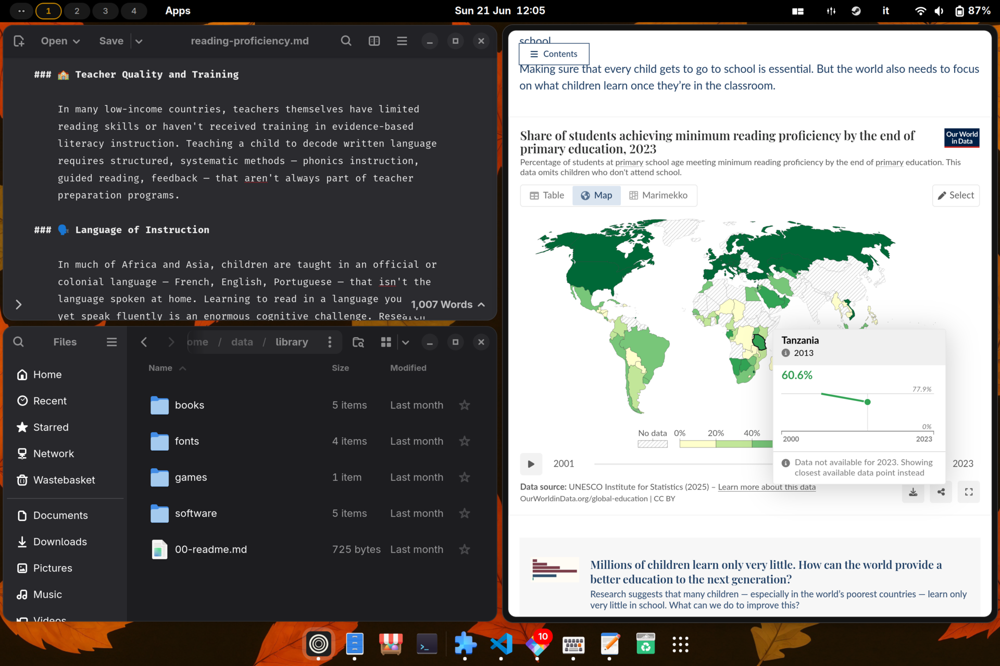

<div align="center">


### An immutable Linux desktop distribution.

Bomb-proof by design, fast on the CachyOS kernel, with a GNOME re-wired for
tiling, every codec and driver already in place, and a curated set of creator
tools that make it ready for work from minute one. Built on
[Bluefin DX](https://projectbluefin.io/) with a Secure Boot-signed
[CachyOS](https://cachyos.org/) kernel.

<p>
  <a href="https://margine.the-empty.place/"></a>
  <a href="https://margine.the-empty.place/handbook"></a>
</p>

> **Curious how all of this is put together?** The [atomic distro
> handbook](https://margine.the-empty.place/handbook) documents the whole
> build, from this repo's code: kernel replacement and Secure Boot signing,
> Flatpak strategies, rechunking, CI with the QEMU smoke gate, ISOs,
> updates — plus every production lesson we learned the hard way. It doubles
> as a generic guide to building your own bootc-based distro.
<p>
  <a href="https://github.com/daniel-g-carrasco/margine-image/actions/workflows/build.yml"></a>
  <a href="https://github.com/daniel-g-carrasco/margine-image/actions/workflows/smoke-boot.yml"></a>
  <a href="https://github.com/daniel-g-carrasco/margine-image/pkgs/container/margine"></a>
  <a href="https://margine.the-empty.place/#install"></a>
  <a href="https://projectbluefin.io/"></a>
  <a href="LICENSE"></a>
</p>

[**🌐 Website**](https://margine.the-empty.place/) ·
[**📥 Install**](https://margine.the-empty.place/#install) ·
[What it is](#what-it-is) ·
[What you get](#what-you-get) ·
[Install](#install) ·
[For developers](#for-developers)

</div>

---

## What it is

Margine is a desktop Linux distribution that follows the immutable /
atomic model: the operating system is shipped as a versioned OCI image,
`/usr` is mounted read-only, and updates are applied by switching to a
new image rather than by modifying files in place. The same model used
by Fedora Silverblue and the Universal Blue images
(Bluefin, Bazzite, Aurora).

It targets users who want a complete, ready-to-use desktop without
configuring the media stack, the kernel, the disk-encryption pipeline,
or the GNOME defaults themselves. The trade-off is the standard one of
immutable distributions: package installation goes through Flatpak,
Toolbox, Distrobox or Homebrew rather than a system package manager;
in exchange, atomic upgrades and atomic rollbacks are first-class
operations.

## What you get

| | |
| --- | --- |
| 🎬 **Complete media stack from first boot** | Mesa freeworld with proprietary codecs (not shipped in Fedora's stock Mesa for licensing reasons), VA-API and VDPAU hardware video acceleration, full ffmpeg with H.264 / H.265/HEVC / AAC / MP3 / AC3 / DTS, and the GStreamer plugin set. DRM content in Firefox- and Chromium-based browsers works without additional setup. |
| ⚡ **CachyOS kernel, signed for Secure Boot** | Mainline kernel from the [`bieszczaders/kernel-cachyos`](https://copr.fedorainfracloud.org/coprs/bieszczaders/kernel-cachyos/) COPR, which includes the BORE scheduler (lower-latency desktop response under load) and several upstream-pending performance patches. The kernel image and every kernel module are signed at build time with the Margine MOK; ISO installs stage the public key in Anaconda before the first post-install reboot, while rebases use a one-shot service fallback. Secure Boot remains enabled once the MOK is enrolled and the kernel chain of trust is verified at every boot. Userspace BPF schedulers from the sibling [`kernel-cachyos-addons`](https://copr.fedorainfracloud.org/coprs/bieszczaders/kernel-cachyos-addons/) COPR ship in base Margine; `scx_loader` stays off by default and can be enabled explicitly with `ujust margine-scheduler <name>` or the desktop picker. |
| 🛡 **Immutable filesystem, atomic upgrades** | The `/usr` tree is part of the bootc deployment and is mounted read-only. Software updates pull a new OCI image from the registry and stage it as a new deployment; the previous deployment is kept on disk. If the new deployment fails to boot or misbehaves, `bootc rollback` switches back to the previous one at the next reboot. Daily updates are orchestrated in the background by Bluefin's `uupd.timer`. |
| 🪟 **GNOME with a tiling workflow** | Stock GNOME Shell, configured with the [o-tiling](https://github.com/oliwebd/o-tiling) extension (binary-tree auto-split inspired by Hyprland) and a Hyprland-style keybinding set: `Super+1..0` for workspaces, `Super+Arrow` to move the focused window, `Super+Shift+Arrow` to move focus, `Super+Return` for the terminal, `Super+E` for Files. Hide Cursor, Caffeine, and Search Light are added to the default Bluefin extension set; LogoMenu is disabled. None of this is enforced — the Extensions Manager remains fully functional and any choice is reversible. |
| 📦 **Curated application set, mostly instant** | ~29 Flatpak apps are **baked into `/var/lib/flatpak` at install time** by the Anaconda kickstart (Bazzite installer-image pattern — see [`installer/Containerfile`](installer/Containerfile)): Zen Browser, Thunderbird, Bitwarden, LibreOffice, Extension Manager, GNOME suite (Calculator, Calendar, clocks, Contacts, Maps, Weather, TextEditor, baobab, Characters, Logs, font-viewer), viewers (Loupe, Papers, Showtime, Snapshot, SoundRecorder), audio (Audacity, EasyEffects, Reaper, g4music, Blanket), Pinta, Apostrophe, Fragments. These are **ready in Activities at first login**, no first-boot wait. Four heavy creative apps (GIMP, Inkscape, darktable, OBS Studio) arrive within 5-15 min of first boot via [`flatpak-preinstall.service`](https://docs.flatpak.org/en/latest/system-installation.html#system-installation-list); a GNOME notification appears at first login telling the user they're coming, and a second notification when they're ready. Visual Studio Code is inherited from Bluefin DX (Microsoft repo, dev-container and remote-ssh extensions). |
| 🛠 **Creator-tier system tools** | The base image also ships **mangohud** (Vulkan/OpenGL overlay for monitoring CPU/GPU/RAM during DaVinci/Blender renders, OBS recording, ffmpeg encoding), **goverlay** (Qt GUI to configure MangoHud), and **steam-devices** (udev rules for USB game controllers — useful for any creator using a controller as jog wheel / foot pedal). Plus the upstream Bluefin DX set: GameMode, input-remapper, tuned, tuned-ppd. |
| ⚙️ **Opt-in CPU scheduler picker** | Activities -> **"Margine CPU Scheduler"** opens a Zenity picker populated from `scxctl list`, including an Off entry that stops `scx_loader` and returns to kernel BORE. Right-click quick actions cover shipped schedulers such as `scx_lavd`, `scx_bpfland`, `scx_rusty`, `scx_flash`, `scx_cosmos`, and `scx_rustland`. CLI equivalent: `ujust margine-scheduler <name>`. |
| 🎮 **Optional gaming layer (two flavours)** | `ujust margine-gaming` installs **gamescope** + **vkBasalt** as `rpm-ostree` layered RPMs and **Steam**, **Lutris**, **Heroic**, **Bottles**, **Protontricks**, **ProtonUp-Qt**, **RetroArch** as Flatpaks. One command, a reboot, gaming is on. For maximum Proton/Wine compatibility (anti-cheat titles, VR, NVIDIA proprietary side-by-side) `ujust margine-gaming-native` instead layers Steam + Lutris + RetroArch as **native RPMs** — better compatibility at the cost of +30-60s per `bootc upgrade`. `ujust margine-gaming{,-native}-remove` rolls either variant back. |
| 🤖 **Optional AI workflow** | `ujust margine-ai` installs [**Alpaca**](https://flathub.org/apps/com.jeffser.Alpaca) — a Flatpak GUI for local LLMs that bundles its own Ollama backend, no host install or daemon-running required. Pick a model from inside Alpaca on first launch (recommended starters: `llama3.1:8b` for general use, `qwen2.5-coder:7b` for code, `phi3.5:3.8b` for CPU-only). Power users who want the [RamaLama](https://github.com/containers/ramalama) CLI in a sandbox get instructions printed by the recipe. `ujust margine-ai-remove` undoes it. |
| 🔒 **Disk encryption and TPM2** | Anaconda installs default to LUKS2 with a strong passphrase. After install, TPM2 unlock can be enrolled with `systemd-cryptenroll`, keeping the passphrase as recovery. Procedure documented in [`docs/07-secure-boot-tpm2.md`](https://github.com/daniel-g-carrasco/margine-fedora-atomic/blob/main/docs/07-secure-boot-tpm2.md). |
| 🧪 **Verified build pipeline** | Every release passes three checks before it can be installed: image-internals inspection (a "candidate" tag is published first), boot test in QEMU, and only then promotion to the public `:stable` tag. A release that doesn't boot in a virtual machine never becomes the one your computer pulls. |
| 📚 **Online + offline documentation** | Activities -> **"Margine documentation"** opens the live docs when the site health check passes and falls back to the local mirror at `/usr/share/margine/offline-docs/` when the machine is offline. The current install recommendation lives at <https://margine.the-empty.place/docs/install-status>. |
| 🗂 **Organized application folders** | GNOME's activities grid is organized into six folders: Office, Graphics, Photography, Audio, Video, System. High-frequency apps (browser, mail, files, terminal, code editor) stay at the top level for one-click access. Editable in the declarative spec. |

## Screenshots

<div align="center">


&nbsp;

&nbsp;


</div>

## Install

As of 2026-06-08, the recommended public path is to install Bluefin DX
stable first, then rebase to Margine. Margine fresh-install ISOs are
still published for validation, but they are the tester path until the
installer path passes fresh-machine checks again. Current status:
<https://margine.the-empty.place/docs/install-status>.

Gaming is a one-command layer on top — `ujust margine-gaming` after
first boot installs gamescope + vkBasalt and the seven gaming Flatpaks
(Steam / Lutris / Heroic / Bottles / Protontricks / ProtonUp-Qt /
RetroArch). The previous separate Margine Gaming ISO + OCI image were
retired 2026-06-06 to cut maintenance — same gaming stack, fewer moving
parts.

- OCI image: `ghcr.io/daniel-g-carrasco/margine:stable`
- Identifies as: `VARIANT_ID=margine`
- ISO test media (Internet Archive): `archive.org/details/margine-anaconda-iso-YYYYMMDD`

### Option A — Rebase from Bluefin DX

The recommended path today. Install Bluefin DX stable, boot it once,
then switch to the Margine image:

```sh
rpm-ostree rebase ostree-image-signed:docker://ghcr.io/daniel-g-carrasco/margine:stable
systemctl reboot
```

After the reboot, two more one-time steps:

1. **Enroll the Margine signing key into Secure Boot.** After rebasing,
   `mok-enroll.service` submits the request during the first Margine
   boot. Reboot once more; a blue/grey screen called **MOK Manager**
   appears automatically. Choose `Enroll MOK` -> `Continue` -> `Yes`,
   type the passphrase **`margine-os`** when prompted, and reboot. From
   this point on the kernel boots normally under Secure Boot and you
   will not see this screen again. Full walkthrough with the exact
   screen-by-screen flow is at
   <https://margine.the-empty.place/docs/first-boot>.
2. Run **`ujust margine-bootstrap`**.

### Option B — Install from ISO test media

Use this path if you are validating fresh installs or once the
install-status page marks the ISO as recommended again.

1. Open the [Margine site Install section](https://margine.the-empty.place/#install)
   for the latest dated identifiers, or browse the full
   [Internet Archive collection](https://archive.org/search?query=creator%3A%22daniel-g-carrasco%22+AND+title%3A%22Margine%22&sort=-date)
   directly. Each release is available as a BitTorrent magnet /
   `.torrent` (recommended) and as a direct HTTP mirror; the same
   bytes are served by both. `SHA256SUMS` is published alongside.
2. Boot the ISO. Anaconda's standard installation flow applies:
   recommended UEFI with Secure Boot enabled, LUKS2 on the root disk,
   Btrfs filesystem (the default).
3. Reboot when the installation completes. MOK Manager should appear
   before the installed system starts; enroll the key with passphrase
   **`margine-os`**, then reboot into Margine.
4. Apply the user-state once:
   ```sh
   ujust margine-bootstrap
   ```
   This runs the idempotent `margine-configure-*` helpers in
   sequence: home layout, GNOME extensions, keybindings, appearance,
   default applications, app folders. Log out and back in to refresh
   GNOME Shell.

### Option C — Add the gaming layer

Margine ships two recipes for the gaming stack; pick one based on
how seriously you game.

**Default (Flatpak — for occasional gamers):**

```sh
ujust margine-gaming            # gamescope + vkBasalt as RPMs + every
                                # launcher (Steam, Lutris, Heroic,
                                # Bottles, Protontricks, ProtonUp-Qt,
                                # RetroArch) as Flatpak. Asks before
                                # touching anything.
systemctl reboot                # required to activate the rpm-ostree
                                # layer.
```

Trade-off: Flatpak Steam is sandboxed (good for upgrades, bad for
some anti-cheat / VR / Mesa-version-matching scenarios).

**Native (RPM-layered — for daily / serious gamers):**

```sh
ujust margine-gaming-native     # Steam + Lutris + RetroArch as native
                                # RPMs (RPM Fusion). Heroic, Bottles,
                                # Protontricks, ProtonUp-Qt stay
                                # Flatpak (no official RPM).
systemctl reboot
```

Trade-off: maximum Proton/Wine compatibility (anti-cheat works,
VR/Steam Link/USB controllers integrate cleanly, Mesa always
matches the system), at the cost of +30-60s per `bootc upgrade` to
re-apply the layer. Recommended if you run EAC/BattlEye titles,
VR headsets, or NVIDIA proprietary + Mesa-git side-by-side.

To remove either:

```sh
ujust margine-gaming-remove        # for the Flatpak variant
ujust margine-gaming-native-remove # for the native variant
systemctl reboot
```

The result of either is a layered (not ostree-canonical) deployment —
`rpm-ostree status` will show `LayeredPackages: gamescope vkBasalt`
(or the larger list for the native variant), and every `bootc
upgrade` re-applies the layer on top of the new base (~30-60s extra
for Flatpak variant, ~60-90s for native). The recipe prints the same warning before the
install prompt.

### Post-install verification

```sh
mokutil --sb-state                       # SecureBoot enabled
uname -r                                 # 7.0.x-cachyos*.fc44.x86_64
margine-validate-atomic-layout
margine-validate-cachyos-kernel
```

## What's inside (technical reference)

<details>
<summary>Full stack summary</summary>

**Base image**: Bluefin DX (stable), Universal Blue's developer-oriented
Bluefin variant. Built on Fedora Silverblue 44. Includes Mesa freeworld,
the full virt stack (libvirt, qemu-kvm, virt-manager, swtpm, edk2-ovmf),
container tooling (podman, docker, distrobox, toolbox), Visual Studio
Code, Cockpit, Tailscale, bpftrace, sysprof. Inherited unchanged by
Margine.

**Kernel**: CachyOS mainline from
[`bieszczaders/kernel-cachyos`](https://copr.fedorainfracloud.org/coprs/bieszczaders/kernel-cachyos/).
vmlinuz signed with `sbsign`; every `.ko*` module signed with
`sign-file`. ISO installs submit the MOK import request from Anaconda
before the first post-install reboot; `mok-enroll.service` remains for
rebases and missed-prompt recovery. Userspace sched_ext BPF schedulers (the
`scx-scheds` package from
[`bieszczaders/kernel-cachyos-addons`](https://copr.fedorainfracloud.org/coprs/bieszczaders/kernel-cachyos-addons/))
are installed in the base image: the `ujust margine-scheduler` recipe
uses `scxctl list` for the shipped scheduler set and switches at
runtime through `scx_loader`. The gaming variant (gamescope, vkBasalt, the
gaming Flatpaks) is opt-in via `ujust margine-gaming` on top of the
same kernel — no separate image.

**Build pipeline**: GitHub-hosted `ubuntu-24.04` runner (the
self-hosted PVE builder was decommissioned 2026-06-01 after a ZFS
spacemap corruption took the host down). The image is built with a
direct `sudo -E buildah build` shell call — the same pattern Bazzite
uses, not the `redhat-actions/buildah-build` action — then run
through [`hhd-dev/rechunk`](https://github.com/hhd-dev/rechunk) so
the OCI layers stay reproducible across upstream base rebases. All
GitHub Actions are SHA-pinned (e.g. `actions/upload-artifact@<sha> #
v7.0.1`) rather than tag-pinned, to avoid the `tj-actions/changed-
files`-style supply-chain attack vector. Cosign signs the pushed
manifest **by digest** (not by tag) in a separate short job, so a
sign-step failure costs ~1 min to re-run instead of redoing the
full ~25-min image build. See the inline history comment at the
top of [`.github/workflows/build.yml`](.github/workflows/build.yml)
for the full rationale.

**Titanoboa migration:** Phase 0 scaffolding is in progress; see
[`margine-fedora-atomic` ADR-0008](https://github.com/daniel-g-carrasco/margine-fedora-atomic/blob/main/docs/adr/0008-titanoboa-migration-plan.md).
Pin: `ublue-os/titanoboa@5c457c3d`.

**Enabled GNOME extensions**: AppIndicator Support, Bazaar Integration,
Blur My Shell, Dash to Dock, Gradia Integration, GSConnect (all from
Bluefin); Search Light, o-tiling, Hide Cursor, Caffeine (added by
Margine).

**Preinstalled Flatpak apps**: Zen Browser, Bitwarden, LibreOffice,
Gapless, GIMP, Inkscape, darktable, Audacity, OBS Studio,
EasyEffects, Reaper, Apostrophe.

**Security**: Secure Boot via the Margine MOK; LUKS2 disk encryption;
optional TPM2 auto-unlock via `systemd-cryptenroll`; `cosign`
signature on the registry image.

**Update orchestration**: `bootc upgrade` daily via `uupd.timer`
(inherited from Bluefin); `flatpak update`, `brew upgrade`,
`distrobox upgrade` also orchestrated by `uupd`. Rollback via
`bootc rollback`.

**CI workflows** (under `.github/workflows/`):
- `build.yml` — builds the image, runs Layer A guardrails, publishes
  `:candidate`.
- `smoke-boot.yml` — boots the candidate in QEMU; on success, promotes
  to `:stable`.
- `build-disk.yml` — builds qcow2 + anaconda-iso for the single
  Margine flavour (2 jobs in parallel), then `publish_ia` uploads
  the ISO to Internet Archive (BitTorrent + 3 HTTP mirrors, seeded
  forever) under the identifier `margine-anaconda-iso-YYYYMMDD`.

</details>

## For developers

The declarative spec, configuration helpers, and validators live in
[`margine-fedora-atomic`](https://github.com/daniel-g-carrasco/margine-fedora-atomic).
This repo (`margine-image`) is only the build pipeline: Containerfile,
build scripts, CI workflows. To change *what* Margine ships — which
apps, which extensions, which keybindings — edit
`declarations/margine-atomic.yaml` in the spec repo. The build picks
up the new versions automatically.

Architectural decisions, postmortems, and the roadmap are documented
under [`docs/`](https://github.com/daniel-g-carrasco/margine-fedora-atomic/tree/main/docs)
in the spec repo.

## Credits

- [**Bluefin**](https://projectbluefin.io/) — base image and source
  of most of what Margine ships.
- [**Universal Blue**](https://universal-blue.org/) — image-template,
  CI patterns, `uupd`.
- [**CachyOS**](https://cachyos.org/) — scheduler and kernel patches.
- [**Origami Linux**](https://gitlab.com/origami-linux/images) — reference
  for the MOK-signing kernel script.
- [**MorrOS**](https://github.com/morrolinux/morros) — CI workflow
  patterns.
- [**hhd-dev/rechunk**](https://github.com/hhd-dev/rechunk) — ostree
  rechunking action.
- [**Internet Archive**](https://archive.org/) — permanent mirror
  and BitTorrent seed for the ISOs.

## License

Apache-2.0.
