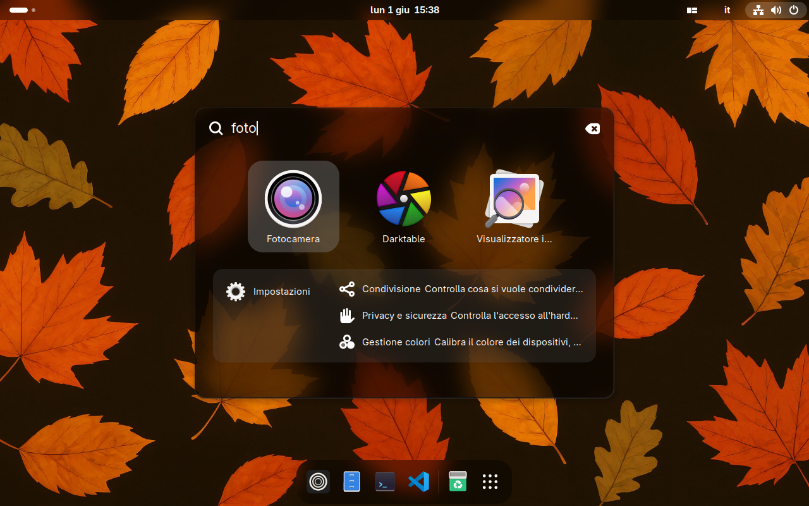
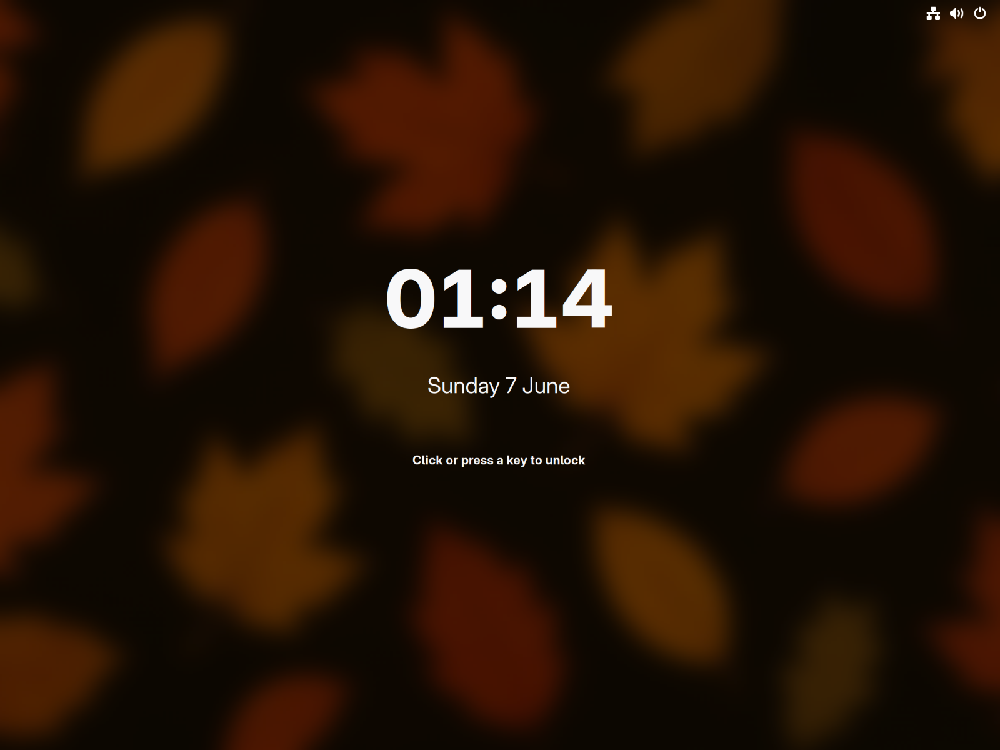

<div align="center">


### An immutable Linux desktop distribution.

Built on [Bluefin DX](https://projectbluefin.io/), with a Secure Boot-signed
[CachyOS](https://cachyos.org/) kernel, GNOME configured for tiling workflows,
a complete media stack, and a curated set of preinstalled applications.

<p>
  <a href="https://margine.the-empty.place/"></a>
</p>
<p>
  <a href="https://github.com/daniel-g-carrasco/margine-image/actions/workflows/build.yml"></a>
  <a href="https://github.com/daniel-g-carrasco/margine-image/actions/workflows/smoke-boot.yml"></a>
  <a href="https://github.com/daniel-g-carrasco/margine-image/pkgs/container/margine"></a>
  <a href="https://github.com/daniel-g-carrasco/margine-image/pkgs/container/margine-gaming"></a>
  <a href="https://margine.the-empty.place/#install"></a>
  <a href="https://projectbluefin.io/"></a>
  <a href="LICENSE"></a>
</p>

[**🌐 Website**](https://margine.the-empty.place/) ·
[**📥 Download**](https://margine.the-empty.place/#install) ·
[What it is](#what-it-is) ·
[What you get](#what-you-get) ·
[Install](#install) ·
[For developers](#for-developers)

</div>

---

## What it is

Margine is a desktop Linux distribution that follows the immutable /
atomic model: the operating system is shipped as a versioned OCI image,
`/usr` is mounted read-only, and updates are applied by switching to a
new image rather than by modifying files in place. The same model used
by Fedora Silverblue and the Universal Blue images
(Bluefin, Bazzite, Aurora).

It targets users who want a complete, ready-to-use desktop without
configuring the media stack, the kernel, the disk-encryption pipeline,
or the GNOME defaults themselves. The trade-off is the standard one of
immutable distributions: package installation goes through Flatpak,
Toolbox, Distrobox or Homebrew rather than a system package manager;
in exchange, atomic upgrades and atomic rollbacks are first-class
operations.

## What you get

| | |
| --- | --- |
| 🎬 **Complete media stack from first boot** | Mesa freeworld with proprietary codecs (not shipped in Fedora's stock Mesa for licensing reasons), VA-API and VDPAU hardware video acceleration, full ffmpeg with H.264 / H.265/HEVC / AAC / MP3 / AC3 / DTS, and the GStreamer plugin set. DRM content in Firefox- and Chromium-based browsers works without additional setup. |
| ⚡ **CachyOS kernel, signed for Secure Boot** | Mainline kernel from the [`bieszczaders/kernel-cachyos`](https://copr.fedorainfracloud.org/coprs/bieszczaders/kernel-cachyos/) COPR, which includes the BORE scheduler (lower-latency desktop response under load) and several upstream-pending performance patches. The kernel image and every kernel module are signed at build time with the Margine MOK; the public key is enrolled into shim's MOK store on first boot via a one-shot service. Secure Boot remains enabled and the kernel chain of trust is verified at every boot. |
| 🛡 **Immutable filesystem, atomic upgrades** | The `/usr` tree is part of the bootc deployment and is mounted read-only. Software updates pull a new OCI image from the registry and stage it as a new deployment; the previous deployment is kept on disk. If the new deployment fails to boot or misbehaves, `bootc rollback` switches back to the previous one at the next reboot. Daily updates are orchestrated in the background by Bluefin's `uupd.timer`. |
| 🪟 **GNOME with a tiling workflow** | Stock GNOME Shell, configured with the [o-tiling](https://github.com/oliwebd/o-tiling) extension (binary-tree auto-split inspired by Hyprland) and a Hyprland-style keybinding set: `Super+1..0` for workspaces, `Super+Arrow` to move the focused window, `Super+Shift+Arrow` to move focus, `Super+Return` for the terminal, `Super+E` for Files. Hide Cursor, Caffeine, and Search Light are added to the default Bluefin extension set; LogoMenu is disabled. None of this is enforced — the Extensions Manager remains fully functional and any choice is reversible. |
| 📦 **Curated application set** | Installed automatically on first boot via the systemd `/usr/share/flatpak/preinstall.d/` API: Zen Browser, Bitwarden, LibreOffice, Gapless, GIMP, Inkscape, darktable, Audacity, OBS Studio, EasyEffects, Reaper, Apostrophe, Extension Manager. Visual Studio Code is inherited from Bluefin DX (Microsoft repo, dev-container and remote-ssh extensions). |
| 🎮 **Gaming variant (optional)** | A separate OCI image — `ghcr.io/daniel-g-carrasco/margine-gaming:stable` — that bakes gamescope, MangoHud, vkBasalt, GameMode, goverlay, steam-devices, input-remapper, tuned, and rom-properties into the image at build time, plus a Flatpak preinstall set with Steam, Lutris, Heroic, Bottles, Protontricks, ProtonUp-Qt, and RetroArch. Switch with `sudo bootc switch ghcr.io/daniel-g-carrasco/margine-gaming:stable`; switch back any time. A `ujust margine-gaming` recipe also lets the base install the same stack as a `rpm-ostree` overlay if you prefer not to swap variants. |
| 🔒 **Disk encryption and TPM2** | Anaconda installs default to LUKS2 with a strong passphrase. After install, TPM2 unlock can be enrolled with `systemd-cryptenroll`, keeping the passphrase as recovery. Procedure documented in [`docs/07-secure-boot-tpm2.md`](https://github.com/daniel-g-carrasco/margine-fedora-atomic/blob/main/docs/07-secure-boot-tpm2.md). |
| 🧪 **Verified build pipeline** | Every release passes three checks before it can be installed: image-internals inspection (a "candidate" tag is published first), boot test in QEMU, and only then promotion to the public `:stable` tag. A release that doesn't boot in a virtual machine never becomes the one your computer pulls. |
| 🗂 **Organized application folders** | GNOME's activities grid is organized into six folders: Office, Graphics, Photography, Audio, Video, System. High-frequency apps (browser, mail, files, terminal, code editor) stay at the top level for one-click access. Editable in the declarative spec. |

## Screenshots

<div align="center">


&nbsp;


</div>

## Install

Margine ships in two flavours: **Margine** (general-purpose desktop)
and **Margine Gaming** (everything in Margine, plus the host gaming
stack baked into the image). Both are bootable ISOs and both can be
reached from an existing Margine / Bluefin install without a fresh
install.

| | Margine | Margine Gaming |
| --- | --- | --- |
| Base | Bluefin DX + CachyOS signed kernel + Margine deltas | Margine + gamescope, MangoHud, vkBasalt, GameMode, goverlay, steam-devices, input-remapper, tuned, tuned-ppd, rom-properties-gtk |
| Pre-installed apps | Curated Flatpak set (browser, office, creative, audio) | Same, plus Steam, Lutris, Heroic, Bottles, Protontricks, ProtonUp-Qt, RetroArch |
| OCI image | `ghcr.io/daniel-g-carrasco/margine:stable` | `ghcr.io/daniel-g-carrasco/margine-gaming:stable` |
| ISO (Internet Archive) | `archive.org/details/margine-anaconda-iso-YYYYMMDD` | `archive.org/details/margine-gaming-anaconda-iso-YYYYMMDD` |
| Identifies as | `VARIANT_ID=margine` | `VARIANT_ID=gaming` |

If in doubt, install **Margine** first. You can switch to the gaming
variant any time with `bootc switch …` (see option C) — no reinstall.

### Option A — Install from ISO

The recommended path. Downloads in one step, installs Margine
directly.

1. Open the [Margine site Install section](https://margine.the-empty.place/#install)
   for the latest dated identifiers, or browse the full
   [Internet Archive collection](https://archive.org/search?query=creator%3A%22daniel-g-carrasco%22+AND+title%3A%22Margine%22&sort=-date)
   directly. Each release is available as a BitTorrent magnet /
   `.torrent` (recommended) and as a direct HTTP mirror; the same
   bytes are served by both. `SHA256SUMS` is published alongside.
2. Boot the ISO. Anaconda's standard installation flow applies:
   recommended UEFI with Secure Boot enabled, LUKS2 on the root disk,
   Btrfs filesystem (the default).
3. Reboot when the installation completes.
4. Apply the user-state once:
   ```sh
   ujust margine-bootstrap
   ```
   This runs the idempotent `margine-configure-*` helpers in
   sequence: home layout, GNOME extensions, keybindings, appearance,
   default applications, app folders. Log out and back in to refresh
   GNOME Shell.

### Option B — Rebase from an existing Bluefin install

Useful if you already have a Bluefin DX installation and don't want
to reinstall from ISO. Picks the base Margine flavour.

```sh
rpm-ostree rebase ostree-image-signed:docker://ghcr.io/daniel-g-carrasco/margine:stable
systemctl reboot
```

After the reboot, two more one-time steps:

1. **Enroll the Margine signing key into Secure Boot.** On the next
   reboot a blue/grey screen called **MOK Manager** appears
   automatically. Choose `Enroll MOK` → `Continue` → `Yes`, type the
   MOK password, and reboot. From this point on the kernel boots
   normally under Secure Boot.
2. Run **`ujust margine-bootstrap`**, as in Option A.

### Option C — Switch between Margine and Margine Gaming

The two variants share the same MOK key and the same base ostree
commits, so switching either direction is a single `bootc switch` +
reboot. Your user data, layered packages, and Flatpaks survive
untouched.

```sh
# Margine → Margine Gaming  (pulls the gaming variant, ~5 min)
sudo bootc switch ghcr.io/daniel-g-carrasco/margine-gaming:stable
systemctl reboot

# Margine Gaming → Margine  (rollback to the base, ~3 min)
sudo bootc switch ghcr.io/daniel-g-carrasco/margine:stable
systemctl reboot
```

On the first boot of the gaming variant, `flatpak-preinstall.service`
installs the 7 gaming Flatpaks (Steam, Lutris, Heroic, Bottles,
Protontricks, ProtonUp-Qt, RetroArch) in the background — count on
~2-3 minutes after the desktop appears.

### Post-install verification

```sh
mokutil --sb-state                       # SecureBoot enabled
uname -r                                 # 7.0.x-cachyos*.fc44.x86_64
margine-validate-atomic-layout
margine-validate-cachyos-kernel
```

### Optional gaming layer on the base Margine

If you installed plain Margine and just want the gaming stack
without switching variant, a separate `ujust` recipe installs
the same set as a `rpm-ostree` overlay + Flatpaks:

```sh
ujust margine-gaming            # install (LayeredPackages overlay)
ujust margine-gaming-remove     # remove
```

This is convenient (one command) but the resulting deployment is
not ostree-canonical — `rpm-ostree status` will show
`LayeredPackages: gamescope mangohud …`, and every `bootc upgrade`
re-applies the layer on top of the new base (~30-60s extra). For
a stable gaming setup prefer Option C above (the variant image).
The `ujust margine-gaming` recipe prints the same warning before
the install prompt.

## What's inside (technical reference)

<details>
<summary>Full stack summary</summary>

**Base image**: Bluefin DX (stable), Universal Blue's developer-oriented
Bluefin variant. Built on Fedora Silverblue 44. Includes Mesa freeworld,
the full virt stack (libvirt, qemu-kvm, virt-manager, swtpm, edk2-ovmf),
container tooling (podman, docker, distrobox, toolbox), Visual Studio
Code, Cockpit, Tailscale, bpftrace, sysprof. Inherited unchanged by
Margine.

**Kernel**: CachyOS mainline from
[`bieszczaders/kernel-cachyos`](https://copr.fedorainfracloud.org/coprs/bieszczaders/kernel-cachyos/).
vmlinuz signed with `sbsign`; every `.ko*` module signed with
`sign-file`. MOK enrollment via `mok-enroll.service` on first boot
after install/rebase.

**Enabled GNOME extensions**: AppIndicator Support, Bazaar Integration,
Blur My Shell, Dash to Dock, Gradia Integration, GSConnect (all from
Bluefin); Search Light, o-tiling, Hide Cursor, Caffeine (added by
Margine).

**Preinstalled Flatpak apps**: Zen Browser, Bitwarden, LibreOffice,
Gapless, GIMP, Inkscape, darktable, Audacity, OBS Studio,
EasyEffects, Reaper, Apostrophe.

**Security**: Secure Boot via the Margine MOK; LUKS2 disk encryption;
optional TPM2 auto-unlock via `systemd-cryptenroll`; `cosign`
signature on the registry image.

**Update orchestration**: `bootc upgrade` daily via `uupd.timer`
(inherited from Bluefin); `flatpak update`, `brew upgrade`,
`distrobox upgrade` also orchestrated by `uupd`. Rollback via
`bootc rollback`.

**CI workflows** (under `.github/workflows/`):
- `build.yml` — builds the image, runs Layer A guardrails, publishes
  `:candidate`.
- `smoke-boot.yml` — boots the candidate in QEMU; on success, promotes
  to `:stable`.
- `build-disk.yml` — matrix over `image: [margine, margine-gaming]`
  × `disk-type: [qcow2, anaconda-iso]` (4 jobs in parallel) +
  per-variant `publish_ia` jobs that upload to Internet Archive
  (BitTorrent + 3 HTTP mirrors, seeded forever) under per-variant
  identifiers `margine-anaconda-iso-YYYYMMDD` /
  `margine-gaming-anaconda-iso-YYYYMMDD`.
- `build-gaming.yml` — builds the `margine-gaming` OCI variant
  (FROM `margine:stable` + gaming RPM stack + Flatpak preinstall).
  Trigger: `workflow_run` after a successful base smoke-boot, plus
  weekly Sunday and `workflow_dispatch`.

</details>

## For developers

The declarative spec, configuration helpers, and validators live in
[`margine-fedora-atomic`](https://github.com/daniel-g-carrasco/margine-fedora-atomic).
This repo (`margine-image`) is only the build pipeline: Containerfile,
build scripts, CI workflows. To change *what* Margine ships — which
apps, which extensions, which keybindings — edit
`declarations/margine-atomic.yaml` in the spec repo. The build picks
up the new versions automatically.

Architectural decisions, postmortems, and the roadmap are documented
under [`docs/`](https://github.com/daniel-g-carrasco/margine-fedora-atomic/tree/main/docs)
in the spec repo.

## Credits

- [**Bluefin**](https://projectbluefin.io/) — base image and source
  of most of what Margine ships.
- [**Universal Blue**](https://universal-blue.org/) — image-template,
  CI patterns, `uupd`.
- [**CachyOS**](https://cachyos.org/) — scheduler and kernel patches.
- [**Origami Linux**](https://gitlab.com/origami-linux/images) — reference
  for the MOK-signing kernel script.
- [**MorrOS**](https://github.com/morrolinux/morros) — CI workflow
  patterns.
- [**hhd-dev/rechunk**](https://github.com/hhd-dev/rechunk) — ostree
  rechunking action.
- [**Internet Archive**](https://archive.org/) — permanent mirror
  and BitTorrent seed for the ISOs.

## License

Apache-2.0.
