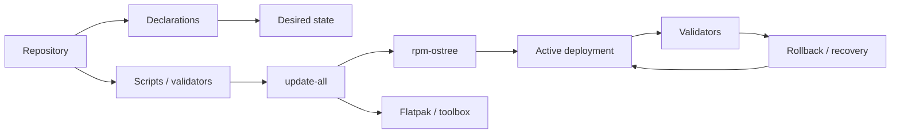

<p align="center">
  
</p>

<p align="center">
  An experimental Margine OS variant built on Fedora Silverblue: validated Fedora Atomic
  Desktop with reproducible system definition, recoverable updates, and inspectable operations.
</p>

<p align="center">
  <a href="docs/02-install-lab.md">Install</a>
  ·
  <a href="docs/04-validation.md">Validate</a>
  ·
  <a href="docs/05-known-risks.md">Risks</a>
  ·
  <a href="docs/adr">ADRs</a>
  ·
  <a href="docs/README.md">All docs</a>
</p>

## Why Margine

Margine is not a frozen distro spin and not a dotfiles dump. It is a versioned
system definition: manifests describe intent, validators prove the result,
recovery paths stay part of the normal workflow — not emergency procedures.

This repository is the Fedora Atomic branch of that family. The existing
Arch/CachyOS work lives in sister repositories. This branch does not depend on,
import from, or modify them. The goal is to validate whether Fedora Atomic
Desktop can carry the same reproducible, inspectable, recoverable properties
that the Arch-based branch has built — using only Fedora-native mechanisms.

## What Is This

Margine Fedora Atomic starts with Fedora Silverblue 44 and GNOME, then
validates the Fedora Atomic model from first principles before building
anything on top of it:

- rpm-ostree deployments, rollback, and override mechanics
- Fedora Btrfs layout as the desktop storage default
- Secure Boot through the Fedora-native shim and bootloader chain
- TPM2 automatic disk unlock via systemd-cryptenroll and LUKS2
- Intel and AMD open driver stacks, Mesa, VA-API, Vulkan, OpenCL, Rusticl
- PipeWire and WirePlumber as the audio baseline
- Flatpak-first GUI applications, toolbox for development environments
- A desktop gaming runtime built from discrete validated layers
- A declarative desired-state model that respects each channel's real mechanics

Phase 1 is a VM lab. No image builds, no installer automation, no hidden
assumptions imported from the Arch side. Every decision is recorded before
it becomes a procedure.

## Current Phase

Phase 1 · Manual VM lab · Fedora Silverblue 44

See [docs/roadmap.md](docs/roadmap.md) for the full phase plan.

## What You Get

| Area | Margine Fedora Atomic |
| --- | --- |
| Desktop | GNOME stock baseline in phase 1; Hyprland is out of scope until the Atomic model is understood |
| Updates | `update-all` orchestration with a hard rpm-ostree boundary; Topgrade for accessory channels only |
| Recovery | rpm-ostree deployment rollback; CachyOS kernel experiment with a pinned Fedora kernel fallback |
| Storage | LUKS2 + Fedora Btrfs layout; TPM2 auto-unlock via systemd-cryptenroll; passphrase recovery kept |
| Hardware | Intel and AMD open stacks, Mesa, VA-API, Vulkan, PipeWire; no NVIDIA or proprietary default |
| Gaming | Flatpak launchers, optional host runtime helpers, explicit split-lock policy |
| Operations | Shell validators, YAML declarations, diagnostic bundles, ADRs, no installer magic |
| Identity | Margine logo, ASCII terminal branding, `margine-fetch` |

## Architecture At A Glance



## Repository Layout

```
assets/branding/        Margine logo and ASCII identity files
config/topgrade.toml    Topgrade accessory-update profile
declarations/           Draft desired-state declarations (YAML)
docs/                   Architecture, procedures, risks, ADRs, roadmap
files/                  Versioned user-layer files (fastfetch, personal config)
scripts/                Validators, update orchestrator, diagnostics collector
```

Detailed documentation index: [docs/README.md](docs/README.md)

## Lab Usage

Inside the Fedora Silverblue VM:

```sh
git clone <this-repo> ~/dev/margine-fedora-atomic
cd ~/dev/margine-fedora-atomic

scripts/validate-atomic-layout
scripts/validate-hardware-media-stack
scripts/validate-gaming-runtime
scripts/collect-diagnostics
scripts/update-all --dry-run
```

After the CachyOS kernel experiment:

```sh
scripts/validate-cachyos-kernel
scripts/collect-diagnostics
```

Validation scripts are read-only. They do not install packages, change boot
configuration, or modify rpm-ostree deployments. `collect-diagnostics` writes
local output under `diagnostics/`, which is excluded from version control.

## Related

- [`margine-os`](../margine-os/): Arch/Hyprland public baseline
- [`docs/06-personal-migration-assessment.md`](docs/06-personal-migration-assessment.md): what carries over from Margine Personal
- [`docs/README.md`](docs/README.md): documentation map and reading order

## Primary References

- Fedora Atomic Desktops: https://fedoraproject.org/atomic-desktops/
- Fedora Silverblue: https://fedoraproject.org/atomic-desktops/silverblue/
- Fedora Silverblue 44 download: https://fedoraproject.org/atomic-desktops/silverblue/download/
- Fedora Silverblue technical information: https://docs.fedoraproject.org/en-US/fedora-silverblue/technical-information/
- Fedora Silverblue getting started: https://docs.fedoraproject.org/en-US/fedora-silverblue/getting-started/
- Fedora Silverblue updates and rollbacks: https://docs.fedoraproject.org/en-US/fedora-silverblue/updates-upgrades-rollbacks/
- rpm-ostree: https://coreos.github.io/rpm-ostree/
- rpm-ostree administrator handbook: https://coreos.github.io/rpm-ostree/administrator-handbook/
- Fedora Btrfs wiki: https://fedoraproject.org/wiki/Btrfs
- Fedora Secure Boot: https://fedoraproject.org/wiki/Secureboot
- systemd-cryptenroll manual: https://www.freedesktop.org/software/systemd/man/latest/systemd-cryptenroll.html
- Mesa Rusticl documentation: https://docs.mesa3d.org/rusticl.html
- Bazzite and Fedora Atomic comparison: https://docs.bazzite.gg/General/Fedora_Atomic_Comparison/
- Topgrade repository: https://github.com/topgrade-rs/topgrade
- Fedora/CentOS bootc docs: https://fedora.gitlab.io/bootc/docs/bootc/
- COPR docs: https://docs.copr.fedorainfracloud.org/
- CachyOS Fedora COPR packaging: https://github.com/CachyOS/copr-linux-cachyos
