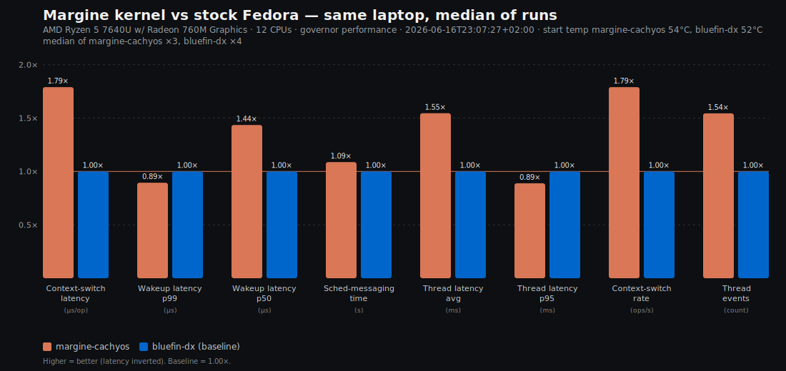

## Margine kernel vs stock Fedora — same laptop, median of runs

*Framework Laptop 13 (AMD Ryzen 5 7640U, Radeon 760M) · 12 CPUs · governor performance · 2026-06-16T23:07:27+02:00 · start temp margine-cachyos 54°C, bluefin-dx 52°C · median of margine-cachyos ×3, bluefin-dx ×4. Lower is better for latency/time, higher for throughput. Baseline for the deltas is **bluefin-dx**. Each run executed the same `margine-bench-kernel.sh` under a `stress-ng` background load.*

| Metric | **margine-cachyos** | bluefin-dx | margine-cachyos vs bluefin-dx |
|---|---|---|---|
| Context-switch latency (µs/op) | **4.45** | 7.97 | **79% faster** |
| Wakeup latency p99 (µs) | **11,984** | 10,720 | **11% slower** |
| Wakeup latency p50 (µs) | **2,076** | 2,980 | **44% faster** |
| Sched-messaging time (s) | **2.99** | 3.25 | **9% faster** |
| Thread latency avg (ms) | **4.08** | 6.3 | **55% faster** |
| Thread latency p95 (ms) | **23.9** | 21.3 | **11% slower** |
| Context-switch rate (ops/s) | **224,501** | 125,436 | **79% higher** |
| Thread events (count) | **88,163** | 57,084 | **54% more** |

